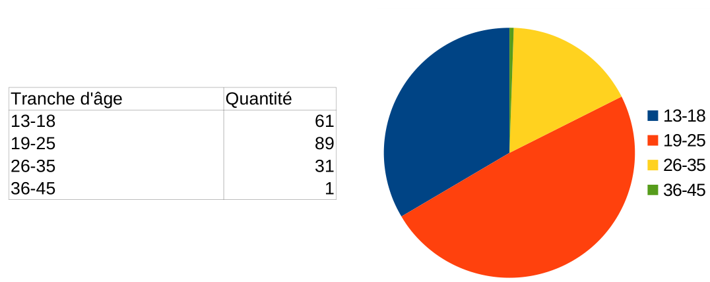
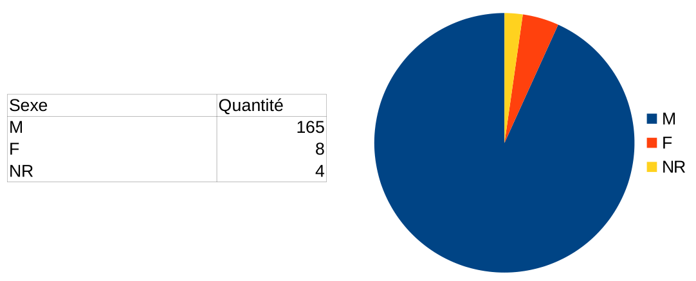
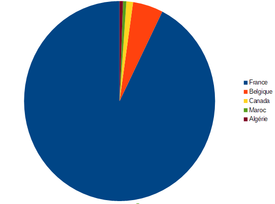
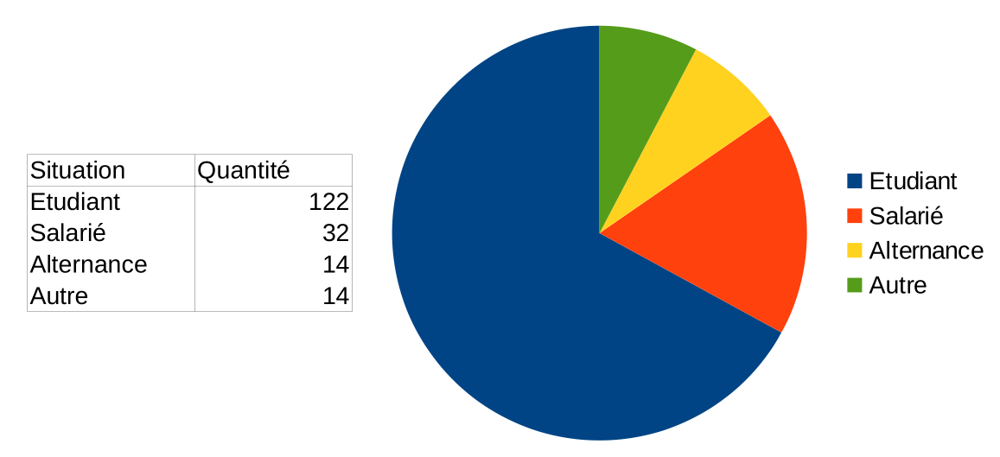
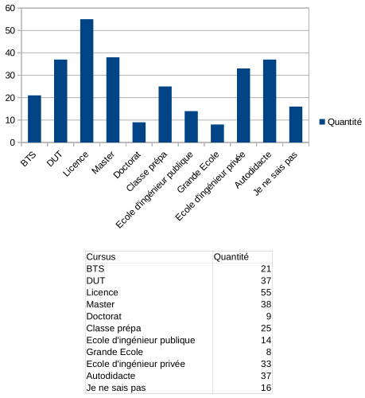
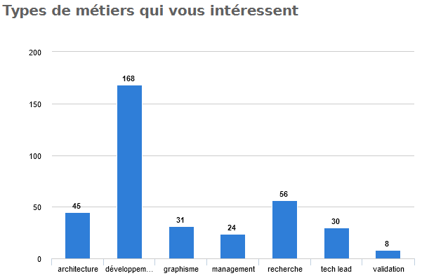
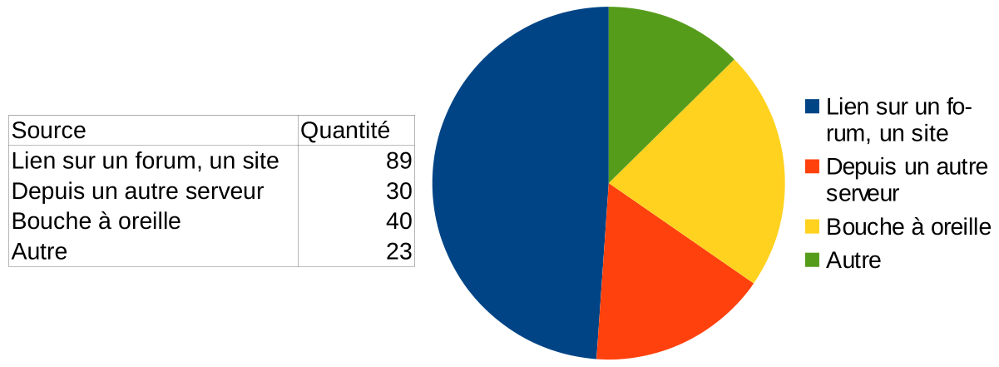
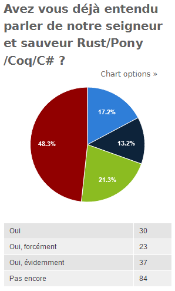

# Résultats sondage NaN 2019

## Données statistiques simples

L'ensemble de ces données est bien entendu à modérer par le fait que nous nous basons sur un peu moins de 200 répondants.

### Tranche d'âge

### Sexe

Moins de 7% de femmes. Largement inférieur à ce qu'on trouve dans le domaine informatique (estimé à environ 25%).

### Région d'origine

Très vaste majorité originaire de France, quelques personnes de Belgique et plus rarement du Canada, de l'Algérie et du Maroc

(Oui il manque le tableau des chiffres, mais en fait c'est parce que ... Attention Jérémy derrière toi c'est affreux !)

### Situations

### Cursus suivis

### Métiers (pratiqués ou visés)

### Domaines d'intérêt

### Comment avez vous entendu parler de NaN ?

### Votre activité sur le serveur

## Résumé des questions ouvertes

La communauté formée ici est d'après vous un atout. Une tendance générale est que la
majorité d'entre vous cherchaient des passionnés de développement et plus généralement
d'informatique. Ils ont eu la surprise de trouver une communauté vraiment nombreuse et
active. la qualité et la pertinence des réponses est globalement appréciée, même si
certains membres disent avoir l'impression que l'on esquive ou ignore leurs questions.
Du côté du staff, nous n'avons que très peu vu de telles situations. Il faut bien
comprendre que deux cas de figures peuvent arriver:

- personne n'a la réponse à votre question (si vous êtes quelqu'un d'avancé, ce n'est
  pas surprenant),
- votre question n'est pas forcément bien formulée et auquel cas, préciser régulièrement
  où vous en êtes dans votre réflexion pendant que vous cherchez vous même une solution
  peut vous aider à vous faire comprendre.

En revanche, on ne peut pas forcer les gens à vous fournir des réponses. La vaste
majorité des répondant sont ici parce qu'ils veulent aider et être aidés. Même si, et
certains l'ont fait remarquer également, le pourcentage d'actifs reste faible. Donc il
y a *a priori* une bonne quantité de personnes volontaires en face de vous et qui veulent
aider. Certans ont même eu l'agréable surprise de constater qu'ils étaient capables de
fournir une aide pertinente.

La moyenne d'âge, un peu plus élevée que la moyenne des serveurs Discord francophones
en développement semble également apprécié ainsi que la cohésion de la communauté.
Cependant, cela crée parfois des frictions, et si les débats peuvent parfois s'échauffer,
cela ne vous pose pas de problèmes tant qu'il n'y a pas de débordement, et sur ce point
vous êtes plutôt d'accord avec le fait que cela devrait être un peu mieux maîtrisé parfois.

Globalement l'expertise technique de certains membres a été une bonne surprise pour
beaucoup d'entre vous. Même si le niveau ardu de certaines conversations, techniquement,
peut faire ressentir aux débutants une certaine difficulté à s'insérer dans ces topics.
Cela se ressent également dans le fait qu'une tendance à réclamer l'arrivée de nouveaux
experts sur certaines technos ou langages pas forcément représentés se dégage des réponses.
Sur ce point nous ne pouvons pas faire beaucoup plus que continuer à parler du serveur
autour de nous.

Certaines personnes pensent qu'il y a une trop forte intolérance à l'erreur parfois.
C'est peut être le cas. La tendance inverse à s'entêter dans l'erreur est en revanche
aussi dommageable. Ces deux points peuvent être améliorés. Du côté des experts comme de
celui des débutants.

Les professionnels présents sur le serveur présentent aussi un intérêt pour les débutants
en ce qui concerne les renseignements à propos des études et de l'emploi. Les offres
d'emploi présentées par le serveur sont appréciées. Il y a également quelques demandes
pour que cela soit étoffé, notamment à travers de partenariats d'entreprise pour la
recherche de stages ou de missions freelance. Pour information, sur ce point, le staff
ne rejettera pas des offres légales et sérieuses. En revanche, nous ne pensons pas qu'il
soit raisonnable que nous nous lancions dans de la prospection de ce côté. Cela
demanderait trop de temps et d'investissement.

Vous êtes une vaste majorité à considérer que la multi-disciplinarité du serveur impliquant:

- que les salons sont clairement identifiés (et avec peu de sujets annexes dans les
  salons),
- que les discussions annexes, dérivant parfois sur du technique, sont dans des channels
  plus généraux,

Et donc par conséquent que les salons généraux permettent à de nombreux sujets de se
croiser, est un gros atout. Beaucoup de commentaires nous indiquent que la variété des
sujets est une bonne surprise globale avec même certaines personnes qui ont découvert de
nouveaux centres d'intérêt grâce à cela, notamment pour certains langages peu connus ou à
travers les discussions du canal #sciences.

Parmi les sujets demandés, on trouve les questions de sécurité et de hacking,
d'informatique théorique, de développement Mobile, et le langage Ruby. La difficulté d'un
canal sécurité est que l'on devrait en permanence flirter avec les limites de la légalité,
ce qui est complexe avec une communauté de cette taille. Pour l'informatique théorique,
cela semble être une portion assez faible de la communauté. Un sondage sera ouvert pour
la programmation d'application mobile.
Le canal Ruby a fait l'objet d'un test et après plusieurs semaines sans aucun message, il
n'a pas semblé raisonnable de le conserver.

De manière générale, pour les sujets peu représentés, nous pensons que les regrouper par
topics plus larges permet aux discussions de gagner en visibilité. Dans un canal isolé, les
chances que le sujet passe inaperçu sont élevées, entraînant le fait que le sujet ne peut que
difficilement attirer de nouvelles têtes.

A l'inverse, les sujets populaires n'ont pas de mal à se faire leur propre "pub". A tel
point que certains membres trouvent que les canaux techniques peuvent déjà être encombrés
et que des canaux pour des frameworks devraient voir le jour. C'est à étudier, mais la
multiplication des canaux rend leur gestion difficile.

A la marge, une petite minorité réclame le relâchement des règles sur les topics
techniques pour favoriser un cloisonnement de sous-communautés au sein du serveur. A la
lumière des avis globaux préférant une organisation claire en topic, compensée par le fait
que nous estimons qu'il est préférable de donner de la visibilité aux sujets mineurs, nous
pensons que cela nuirait au côté pluridisciplinaire/découverte du serveur.

Les bots du serveur sont bien appréciés notamment Not a Bot et RTFM. Certaines demandent
tournent autour des systèmes de news. Du côté du staff, on est toujours un peu frileux à
ce sujet: nous pensons que ce channel sera soit trop général pour présenter un intérêt
technique. Soit complètement croulant sous tellement de news que faire le tri demanderait
un temps fou.

La mise en avant des projets et du système de recrutement plaît. Il y a des demandes pour
que cela soit étoffé. Certains estiment qu'une page web référencée depuis le Discord, et
organisée de manière plus claire que ce que l'on peut faire sur Discord serait un plus.

Il y a des demandes pour plus d'animations. Notamment la production de tutoriels (voir de
formations), un système de mentorat, la création de challenges, le retour des talks qui
étaient faits au début de l'existence du serveur, plus de lives de développement et des
rencontres IRL.

La production de tutoriels est une activité très chronophage, et il est difficile de les
partager efficacement sur Discord. Certains membres travaillent à ce genre d'activité mais
cela nécessite forcément du temps. En général, nous préférons rediriger vers les sites
respectifs des auteurs ou encore la plateforme Zeste de Savoir car ces médias sont faits
pour avoir quelque chose de plus permanent.

Au sujet d'un système de mentorat, nous pensons que ce n'est pas une bonne idée car il a
plus de chances de nuire à votre apprentissage, tout en mobilisant une personne pour vous
aider de manière plus personnalisée (ce qui va nécessairement lui demander du temps, et
quand on est pro, c'est pas forcément ce qu'on a le plus). Participer à des discussions
avec des participants divers et nombreux vous permet d'avoir de nombreux avis différents,
et de voir la confrontation de ces idées à travers les discussions, si vous débutez, c'est
un gros avantage pour vous, cela vous permet de penser à beaucoup de choses que vous
n'auriez pas forcément vues vous même et qu'un mentor aurait tout à fait pu louper aussi,
un mentor est humain, il fait des erreurs aussi.

Les challenges, les talks et les lives nécessitent une certaine organisation, cela demande
du temps. Si certains d'entre vous se sentent en position de proposer de telles activités,
n'hésitez pas à contacter le staff à ce sujet à condition d'avoir en tête un plan d'action
à peu près pertinent. S'il est évident à la lecture de votre plan que vous foncez dans un
mur, nous n'hésiterons pas à le dire en retour. N'oubliez pas que si vous vous lancez là
dedans, les participants auront une attente forte envers vous, c'est tout autant une
occasion de vous faire bien voir comme de vous mal voir.

Finalement pour les recontres IRL, nous en avons organisé quelques unes jusqu'ici (principalement à Paris et à Lyon) et avons pu passer un moment agréable avec quelques-un d'entre vous, nous continuerons à en organiser mais cela demande également pas mal de temps et d'organisation de la part de beaucoup de personnes, et la taille croissante du serveur nous pousse à nous demander comment gérer un grand nombre de personnes, freinant un peu l'idée d'IRL dans les grandes villes (type Paris) en attente d'une bonne solution.

Certains commentaires font état d'insultes par MP. Quand cela vous arrive, ne vous contentez
pas d'ignorer. Envoyez un MP au Staff avec des screenshots de la conversation, que l'on
puisse "gérer" les énergumènes responsables.

Le mot du fondateur:

Lynix vous aime, et il est très content :)
Lynix aime souvent vos lettres et le drama qui les accompagnent.
Parfois Lynix n'aime pas que vous envoyiez des lettres avec du drama.

## Pour le Lulz

### Listes des personnes à bannir

Random, Shika, Lynix, Les gens qui respectent les règles, @everyone, IAMISSAM, Dreais,
Mortim, Nicolas, Razakel, Les anti-rust, 90% des membres, Personne, Dr Peuk, Lui, Pas lui,
Yamashi, Le répondant numéro 83, Jul, Les idiots, Les anti-haskell, Redflyo, Les dévs Java,
Loïc, Charles, GBDivers, Praetonus, REMqb, Alka, x0rld, @everyone sauf Lynix et Raza, La
purge décidera.

Nous essayons de démêler les contradictions, on vous tient au jus.

### Personnes à passer modo

Yamashi, TnTakara, Lui, Lynix, Les gens qui aident, IAMISSAM, Sami, Les pro-Rust, Personne
9.82% des membres, PowerFR, Sakuto, Dr Peuk, Personne, Random, Lazor, Le répondant numéro 81,
Raza, Artemis, Kwak, DevelopHeureShell, Not a Bot, Mortim, Shika, Tatsushiro,
La commode à linge de Dr Peuk, @eveyrone sauf Random, Rayan, Ardakaniz.

Nous essayons aussi de démêler ce bazar.

### Ne devrait plus être modo

Lynix, Pas Lynix, Sokatu, IAMISSAM, Lui, Dieu, Faites du Rust, Personne,
0.18% des membres, Loïc, Random, @everyone sauf les répondants 81 et 83, Jean Marie le Pen,
Dr Peuk, Nous tous, Charles, Les anti-rust, Praetonus

### Avez vous déjà entendu parler des langages qui sauvent le monde ?

Ces statistiques nous disent que 100% des gens ont entendu ou entendront un jour parler
des langages magiques.

## Les vraies questions importantes

Le voilà, le moment que vous attendiez tous, qui dans le staff est le petit préféré et qui
est le grand méchant loup ? Sans plus attendre les résultats.

### Le plus méchant des modos

### Le plus gentil des modos

### Le plus méchant des admins

### Le plus gentil des admins

