# Résultats sondage NaN 2021

## Données statistiques simples

L'ensemble de ces données est bien entendu à modérer par le fait que nous nous
basons sur un peu moins de 230 répondants.

### Tranche d'âge

Par rapport à 2019, la proportion de 19-25 a reculé, celle de 13-18 est resté
relativement stable. En moyenne, le serveur vieillit donc un peu.

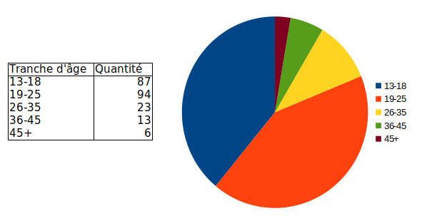

### Mixité

Ici un diagramme n'apporterait que peu d'information. Il semble qu'il y ait
moins de 6% de femmes parmi les répondants, en recul par rapport à 2019.
C'est largement inférieur à ce qu'on trouve dans le domaine informatique
(estimé à environ 25%).

### Région d'origine

Très vaste majorité originaire de France, quelques personnes de Belgique et plus
rarement de quelques autres pays, listés ci-dessous.

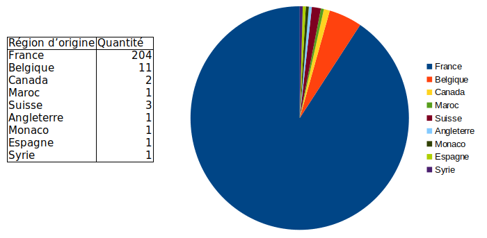

### Situations

Ces proportions sont sensiblement similaires à ce que l'on trouvait déjà en
2019.

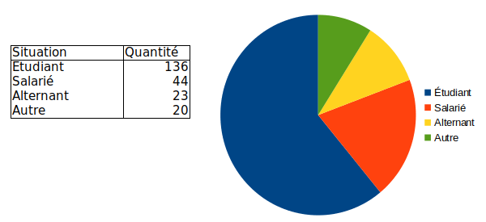

### Cursus suivis

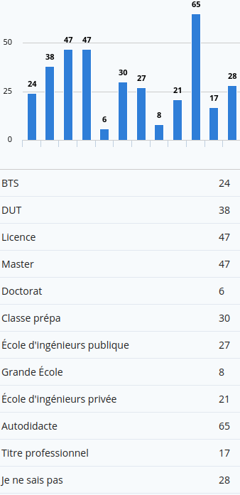

### Métiers visés

Parmis les métiers visés par les répondants non listés ici, on trouve notamment
les métiers de l'enseignement et de la sécurité.

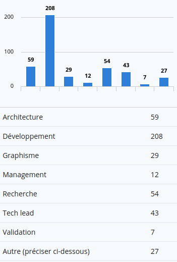

### Domaines visés

Parmis les domaines visés par les répondants non listés ici, on trouve notamment
le monde du hardware, d'autre discipline théoriques (mathématique, physique, ...),
ou certains pans très particuliers de la sécurité.

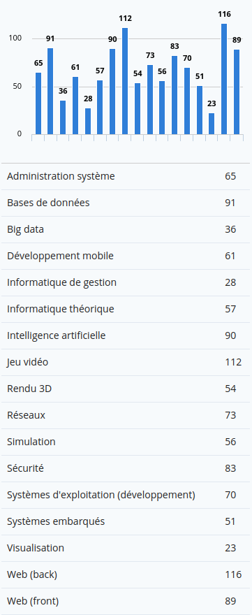

### Comment avez vous entendu parler de NaN ?

Les autres serveurs Discord et le bouche à oreille ont gagné un peu de terrain
sur les forums et sites internet.

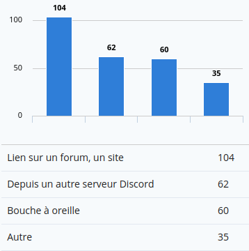

### Votre activité sur le serveur

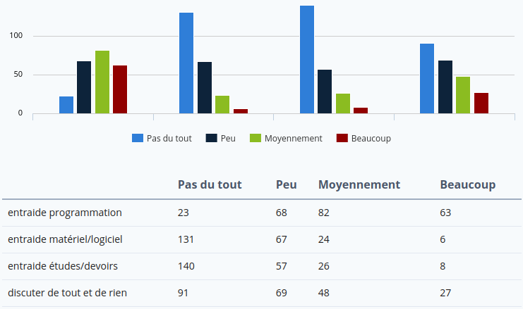

## Défis

Environ 10% des répondants on déjà participé au moins une fois à un défi.

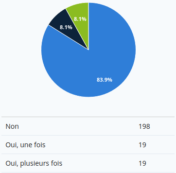

Peu de gens n'y participent pas par manque d'intérêt mais plutôt parce qu'ils ne
connaissaient pas les défis ou n'ont pas le temps.

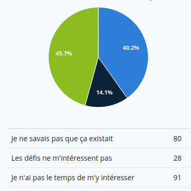

Globalement, les retours de la question ouverte sur les défis sont plutôt
positifs, les défis sont notamment appréciés pour l'usage que l'on peut en faire
pour s'entraîner, en dehors de la période allouée à chaque défi.

La principale inquiétude qui en ressort est que les débutants ont
peur de ne pas avoir le niveau pour réaliser les projets et ne se sentent pas
assez accompagnés par les sujets pour les réussir. Le temps nécessaire
pour réaliser les défis semblent être un frein pour beaucoup. Certains
s'inquiètent également de l'investissement inégal des ambassadeurs dans
l'activité. Sur ce dernier point, nous rappelons que les ambassadeurs font tout
cela sur leur temps libre et sur la base du volontariat. Tout comme le temps
nécessaire à la réalisation d'un défi peut être un frein pour un participant, le
temps nécessaire à l'organisation et l'accompagnement de ce défi peut être
également un frein pour un ambassadeur.

D'autres avis tendent à dire que certains défis tendent à l'implémentation de
cas d'école. Certains proposent la mise en place d'un nivellation plus claire
des défis pour que chacun y trouve son compte.

## Questions ouvertes sur le serveur

Globalement les avis sur le serveurs sont largements positifs. Certains éléments
sont communs avec le précédent sondage aussi je vais résumer rapidement ces
points et me concentrer sur ce qui a pu changer.

Les facteurs les plus appréciés dans la communauté sont la diversité des profils
et la pluridisciplinarité importante à travers un média beaucoup plus interactif
qu'un forum. En particulier, la présence de développeurs professionnels est un
bonus pour tout le monde que cela concerne la question de l'aide technique ou
celle liée à l'orientation. On trouve également des réponses plus poussées que
ce qui peut se faire ailleurs.

Les débutants ne sont globalement pas inquiétés de parler sur le serveur, il n'y
a pas vraiment de "ticket  d'entrée" (même si une ou deux personnes sur ~230 ont
fait part de ce ressenti dans cet espace de réponses).

Il y a nettement moins de personnes pour se plaindre du côté désagréable de
certaines réponses (12 sur ~230), c'est mieux, mais il faut continuer dans ce
sens. Le pendant inverse de cela est que l'on trouve aussi des avis parlant de
débutants ne faisant pas l'effort d'avancer par eux mêmes (à nouveau en faible
proportion, 10 sur ~230).

La maturité du serveur est saluée par presque tout le monde. D'après les
réponses, la modération effectuée y est pour quelque chose, évitant les
débordements la majorité du temps (même s'il arrive que ce ne soit pas le cas).
Le revers de la médaille est que le climat peut se trouver tendu parfois après
que la modération soit passée. Quelques très rares avis (3 sur ~230) pointent
une modération trop stricte nous pensons que c'est la meilleure position pour
maintenir un serveur mature.

La communauté est très grande, cela peut constituer un frein à la participation
pour certains que ne savent pas trop comment se faire une place dedans. En
contrepartie, les gens trouvent de manière largement majoritaire que les
réponses à leurs questions arrivent très vite. En revanche, certaines personnes
font remarquer que certains canaux précédemment actifs ne le sont plus vraiment
(HTML/CSS par exemple). On note également chez quelques personnes que la
quantité d'utilisateur véritablement active n'est finalement pas énorme.

Certaines demandes sont communes à 2019. En particulier, nous retrouvons des
demandes pour des canaux dédiés aux sujets que l'on a aujourd'hui placé dans
la catégorie "bordeline" sur le serveur. Notre position sur le sujet n'a pas
changé. Il est impossible pour nous de se porter garant des membres quand ils
disent ne pas vouloir l'utiliser pour nuire. Et nous ne voulons pas que NaN
soit utilisé pour transmettre des informations qui se révèlent dommageables pour
quelqu'un.

Une personne a également demandé s'il était possible de construire un espace
pour mettre en relation des potentiels clients avec des développeurs.
Actuellement, il nous est difficile de mettre cela en place, partiellement pour
des raisons similaires à ce qu'il y a au dessus : nous ne pouvons pas nous
porter garant des clients/fournisseurs de services et nous ne voulons surtout
pas avoir à gérer de potentiels conflits qui surviendraient à travers un tel
espace, c'est beaucoup trop chronophage.

Nous notons aussi des idées pour lancer des partenariats avec des écoles ou
des associations étudiantes. Ce genre d'activité peut se revéler très vite très
chronophrage. Sans parler du fait que cela voudrait probablement dire que l'on
ferait une forme de publicité pour de potentielles écoles ce qui ne nous semble
pas très éthique (recommander une école au détour d'une discussion avec un
membre sur son orientation est une chose, recommander une école en tant que
serveur de développeurs en est une autre, très différente).

Les activités du serveur sont globalement bien perçue. Que ce soit les espaces
d'exposition (projets, screenshots) ou les lives et défis proposés.

Certaines personnes s'inquiètent (à raison) du turn-over dans le staff. Il faut
bien se rendre compte que modérer une communauté de cette taille de façon
humaine est *très* difficile et fatiguant. Une manière de relâcher la pression
sur le staff pourrait être de ne plus montrer les actions de modérations (ne
plus afficher les messages de bans ou de warn publiquement par exemple). Mais
nous ne sommes actuellement pas pour. Mais il est clair qu'il est aujourd'hui
difficile d'être staff sur NaN sans en avoir rapidement marre.

Il y a des demandes pour faire revenir les talks avec une recommendation
que ces talks soient très interactifs pour permettre un dialogue et pas juste
un exposé. Ce sont des choses qui doivent être réfléchies. Notamment pour savoir
qui est capable d'organiser ça.

Répondants pour les activités à relancer/améliorer:

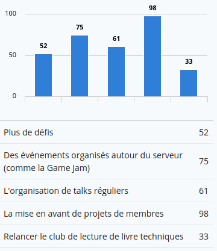

## Pour le Lulz

### Listes des personnes à bannir

Lynix, Random, Pas moi, Les trolls, tous les auteurs de propos sexistes et
autres insultes, dreais, Razounais, Not a Bot, l'admin, jsp, les trolleurs,
je sais pas, les modérateurs, lui, les vieux, ceux qui ont des pseudos
impossible à écrire, les personnes qui manquent de respect aux autres, les bleu,
les insultes mais je pense que c'est déjà fait, une personne piochée au hasard,
va savoir, Kaktus, celui qui a pas mis python en dessous, Lezenn, Mechap,
les devs web, les devs js, mon humour, moi même, les devs JS, les dev Rust,
je ne peux répondre, tout ce qui est contraire aux règlements, tout le monde,
les auteurs de Nazara et Raz, personne, les méchants, Dr peuk car il en sait
trop (et TnTube il attire les problèmes), X, Praetonus (pour ses blagues), idk,
DrLazor, Jean, je connais pas assez les membres, Notabot, je ne sais pas, Moi,
les gens qui disent que java === javascript, les gens qui n'aiment pas le PHP,
le 10.001e membre pour rester à 10.000, dyno, tous les #javascript, pas moi,
les recruteurs qui demandent dès full stack bac +5 avec 5 ans d’expérience en sortie d’école,
roulette, les personnes qui répondent par une personne innocente, personne,
tout le monde est trop gentil, les gens qui respectent pas les règles,
les personnes aux demandes d'aide légalement bordeline, mortim,
Je n'ai pas assez suivi la vie du serveur pour avoir un avis objectif,
les rôles: C, C++, Javascript, Python, cette question, NaN,
la personne qui a pas mis python dans la derniere question de cette page,
Mishaa, Lynix à cause de son non-fond vert, le serv entier, Pytchoun,
Razawafynux, Razadriel, le déchu, les vilains, le Lua, Mestery,
je ne devrais pas avoir ce pouvoir, ..., tous les [Yy][Aa][Nn][Nn]?.*,
Wafelack parce qu'il est insupportable à finir ses phrases avec des points.

(On s'y met)

### Personnes à passer staff

Personne, bannez les tous, Moi, Random, Not a Bot, Passworld, dreais, Pytchoune,
Dr Peuk, Triphase, jsp, idk, tutosfaciles48, Babaloon, je sais pas, lui,
les vieux, peu importe mais surtout pas ceux qui ont des pseudos impossible à
écrire, qq qui a la volonté d'aider les autres, Lynix, Loïc, les membres actifs,
une personne piochée au hasard, Moi un jour j'espère, Kakatus, Dr lazor,
Lezenn, le président vote pour lui même, Jean, ne connaissant pas les membres,
je vais dire Bob l'Éponge, gbdivers, les dev Cobol, bonne question,
je viens d'arrivé dont trop tôt pour le dire, Émie, tous ceux impliqués et qui
souhaitent le devenir, j'aime le staff actuel donc les critères de selection
sont sûrement déjà très bien, Oui, X, Praetonus (pour ses blagues), /,
personne, vive l'anarchie (non), les membres étant actif, qui aide, et tout ça
sur le long terme, même si les reponses non-exact sont dite, je connais pas
assez les membres, je ne sais pas, je ne suis pas la depuis assez logntemps,
les gens qui aiment le PHP, tout le monde, Mjollnir, lezenn ou mishaa,
tous les #python, roulette, Superkooka, Ardakaniz, Mestery peut être, kwak,
je n'ai pas assez suivi la vie du serveur pour avoir un avis objectif,
Wingrog, Frederic Lordon, Eliasazerty,
Je ne sais pas, je ne suis pas assez impliqué pour donner mon avis là dessus,
Utilisateur régulier/fibale/connu et avec une bonne maîtrise de l'environnement
Discord, Stallman, Kaktus, Moi en tant que roi du serveur,
Lezenn (de gré ou de force) , Wafelak, jo_link_noir, florent.

(Il y a des conflits dans la sélection, on va résoudre ça)

### Virer du staff

Lynix, en le bannant ! Lynix est au pouvoir depuis trop longtemps, Random,
personne, Dr Lazor, dreais, ¯\_(ツ)_/¯, Moi juste après avoir rejoint le staff,
jsp, idk, le plus méchant des admins, je sais pas, tous les modérateurs, lui,
les vieux,
Ceux qui sont "pour" les personnes qui ont des pseudos impossible à écrire,
Ras, Raz, jsp, une personne piochée au hasard,
ils font tous très bien leurs travails alors aucun, Kaktus,
celui qui a pas mis python dans la liste en dessous,
Lezenn, personne, vous êtes tous formidables, les belges,
Terry Davis. Non mais sérieux, il est prétentieux le bougre avec son OS tout claqué !
Tout les schtroumpfs, Dr Lazor, Personne, un beau belge, Non, les dev PHP,
Aucune idée, je viens d'arrivé dont trop tôt pour le dire, les autres,
Tous ceux qui touchent de près ou de loin au js, pas d'avis, voir réponse au
dessus, NaB, X, REMqb, c'est un nain, Peuk, les autres, le staff,
les membre qui n'applique pas les regles, je connais pas assez les membres,
Notabot,  je ne sais pas, je ne suis pas la depuis assez logntemps, Moi,
Les gens qui n'aiment pas le PHP, toute l'équipe,
les gens avec un tag impair, je n'aime pas les numéros impairs,
Toi, roulette, Juda, Pas d'avis,
Je n'ai pas assez suivi la vie du serveur pour avoir un avis objectif,
les modos, Tout le monde sauf moi, NaN, la lettre S,
tout le monde sauf NaB notre guide suprême, (cf. la réponse précédente),
I don't know, tout le monde je veux être le seul a régner sur le serveur,
Lynix puisqu'on le ban, tous les autres, Tout le monde, faut purger le staff,
Moi juste après, toi, Dyno, ..., REMqb, celui qui lit cette réponse au formulaire.

(Heureusement que je filtre les doublons, quelle idée d'avoir des questions ouvertes)

### En quel langage devrait être réécrit Not a Bot

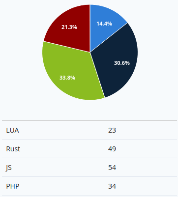

## Les vraies questions importantes

Le voilà, le moment que vous attendiez tous, qui dans le staff est le petit préféré et qui
est le grand méchant loup ? Sans plus attendre les résultats.

### Le plus méchant du staff

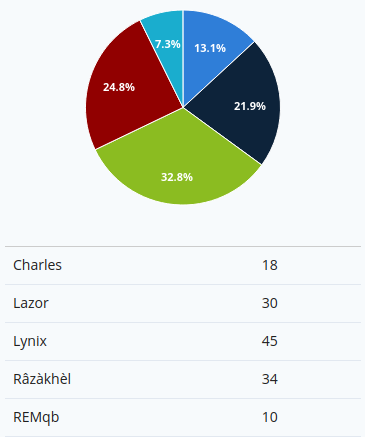

### Le plus gentil du staff

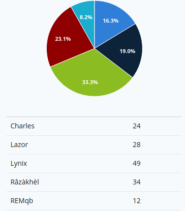

### Le plus méchant des admins

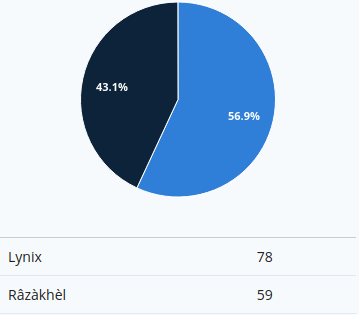

### Le plus gentil des admins

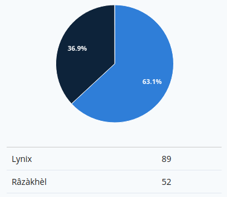
