# Résultats sondage NaN 2023

## Données statistiques simples

L'ensemble de ces données est bien entendu à modérer par le fait que nous nous basons sur un peu plus de 180 répondants.

### Tranches d'âge

Par rapport à 2021, la proportion de 19 – 25 ans a augmenté tandis que la proportion de 13 – 18 a fortement diminué. Les autres tranches d'âge restent stables, on observe donc que la population du serveur vieillit en moyenne.

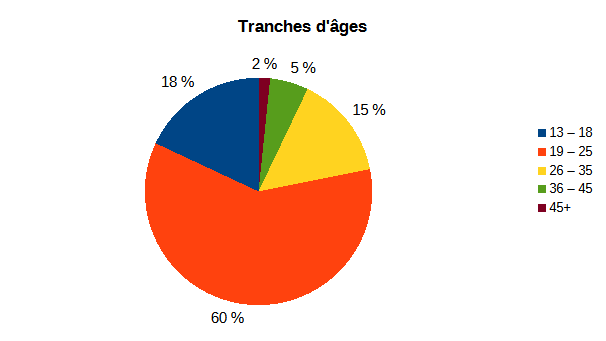

| Tranches d’âges | Quantité |
| --------------- | -------: |
| 13 – 18         | 33       |
| 19 – 25         | 110      |
| 26 – 35         | 27       |
| 36 – 45         | 10       |
| 45+             | 3        |

### Proportion homme/femme

Le serveur comprend moins de 7% de femmes, ce qui est stable par rapport aux années précédentes mais qui reste très inférieur aux 30% estimés dans le domaine de l'informatique de nos jours.

### Pays de résidence

Une très grande majorité originaire de France avec quelques personnes de Belgique, du Canada et d'autres pays en plus faibles proportions.

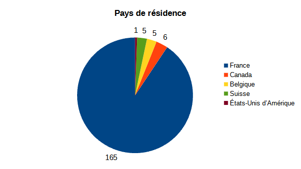

### Situation

La proportion d'étudiants a légèrement baissé au profit de la proportion de salariés. Les autres situations restent semblables.

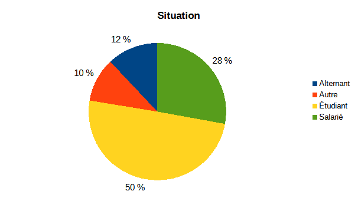

| Situation | Quantité |
| --------- | -------: |
| Alternant | 22       |
| Autre     | 19       |
| Étudiant  | 91       |
| Salarié   | 51       |

### Cursus suivi

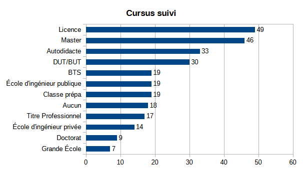

### Domaine exercé ou visé

Parmi les métiers non listés ci-dessous, on trouve entre autres l'enseignement supérieur et la recherche.

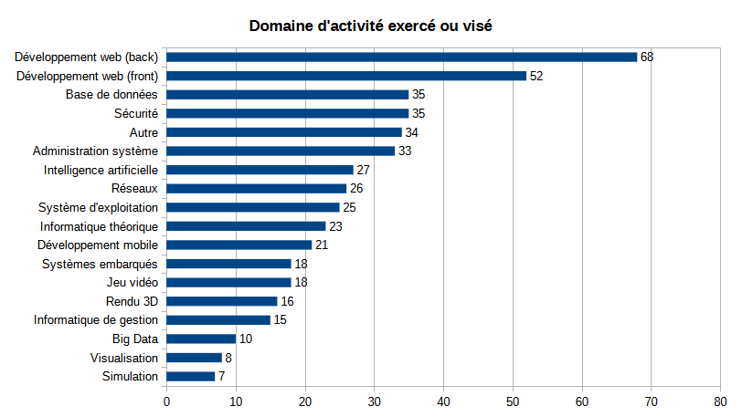

### Découverte du serveur

La majorité des membres ont découvert le serveur via un site tiers ou un autre serveur discord. On observe aussi une part importante de bouche-à-oreille avec une part plus faible de membres en provenance de la recherche intégrée à discord. Dans la catégorie "Autre" on retrouve essentiellement des gens qui ont trouvé le serveur via un moteur de recherche.

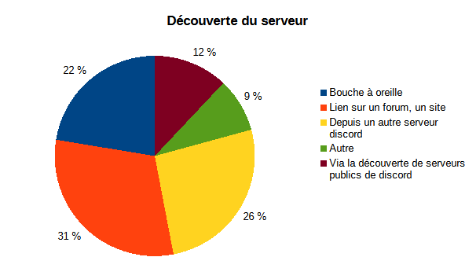

| Découverte du serveur                            | Quantité |
| ------------------------------------------------ | -------: |
| Bouche à oreille                                 | 41       |
| Lien sur un forum, un site                       | 56       |
| Depuis un autre serveur discord                  | 48       |
| Autre                                            | 16       |
| Via la découverte de serveurs publics de discord | 22       |

## Votre activité sur le serveur

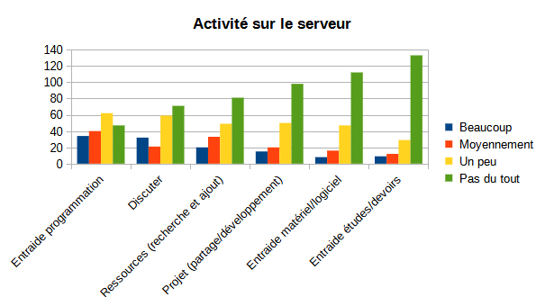

|                                     | Beaucoup | Moyennement | Un peu | Pas du tout |
| ----------------------------------- | -------: | ----------: | -----: | ----------: |
| **Entraide programmation**          | 34       | 40          | 62     | 47          |
| **Discuter**                        | 32       | 21          | 59     | 71          |
| **Ressources (recherche et ajout)** | 20       | 33          | 49     | 81          |
| **Projet (partage/développement)**  | 15       | 20          | 50     | 98          |
| **Entraide matériel/logiciel**      | 8        | 16          | 47     | 112         |
| **Entraide études/devoirs**         | 9        | 12          | 29     | 133         |

### Quel(s) activité(s) aimeriez vous (re)voir sur NaN ?

Environ un tiers des répondants sont intéressés par les défis, un quart par Not a GameJam et quelques autres par un club de lecture. Un autre tiers n'est pas intéressé par les activités autres que l'entraide.
Parmi les autres sujets d'intérêt nous avons les talks et la rédaction de guides pour les débutants.
Si vous avez l'envie et le temps d'organiser une activité (rédiger un défi, organiser une conférence, etc), n'hésitez pas à contacter le staff, il pourra vous aider et vous guider.

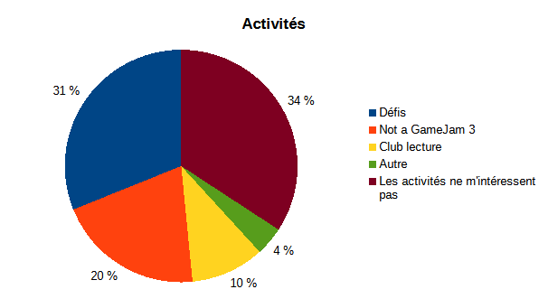

| Activités                          | Quantité |
| ---------------------------------- | -------: |
| Défis                              | 70       |
| Not a GameJam 3                    | 46       |
| Club lecture                       | 23       |
| Autre                              | 9        |
| Les activités ne m'intéressent pas | 77       |

## Not-a-Hub

### Connaissez-vous Not a Hub ?

Plus de la moitié (57%) des répondants ne connaissent pas Not-a-Hub.

### Seriez-vous intéressé pour rédiger de petits articles sur ce blog ?

Environ 22% des répondants seraient intéressés pour rédiger des articles sur le blog. Certaines personnes appréhendent l'idée de publier un article sur internet ou pensent ne pas avoir de compétences suffisantes pour le faire. Pour ceux qui souhaitent contribuer à Not-a-Hub, pensez à rejoindre le canal dédié #notahub.

## Questions ouvertes sur le serveur

Les avis concernant le serveur sont globalement très positifs et similaires à ce qu'on avait en 2021. Je vais résumer ci-après quelques différences et points à améliorer qui ont été remontés.

Il n'y a pratiquement plus de personnes qui se plaignent du coté désagréable de certains membres (2 sur ~180), on observe donc une nette amélioration de ce coté par rapport aux années précédentes. Il est encore possible de faire mieux en accompagnant les débutants avec d'avantage de bienveillance, même si leurs questions peuvent nous sembler parfois simples ou basiques.

Il y a une certaine demande pour le retour des activités (défis, talks et gamejam) qui sont un peu en "pause" en ce moment.

Une personne a indiqué que le canal #actualité-brulante apportait une mauvaise ambiance et était globalement nocif pour le serveur, cela correspond au ressenti du Staff et c'est ce qui a conduit à sa fermeture.

Les divers projets, notamment Not-a-Hub mais pas que, semblent manquer de visibilité. Comme le graphe ci-dessus le montre, une grande partie des répondants n'en avaient jamais entendu parler, et des retours en ce sens ont été fait.

Certaines personnes ont émis le souhait de s'impliquer d'avantage dans l'animation du serveur au travers des différentes activités.

## Lulz

### Quel est le plus gentils des modos ?

?, ¯\_(ツ)_/¯, Mjölnir, Elanis, Elanis, LAZOR, Elanis, (je ne sais pas qui est Lynix), Lynix, Lynix, REMqb, Peu importe, suffit qu'ils sout en majorité gentils, Je connais aucun des modos, Lynix, C'est pas plutôt qui pour que ce soit grammaticalement correct, Razakhel, remqb car il parle jamais donc fondamentalement le plus gentil, Elanis, Elanis, Lynix, Elanis, Lynix, lazor bien-sûr, Elanis, Lynix, Elagentil, Elanis, Aucune idée, Aucun, Lazor kappa, Lord 3P, Moi., lynix, Not a Bot, Aucune idée, Mjöllnir, Lazor, NotLynix, Elanis, Elanis, Elanis, Raz, Elanis, Elanyx, Elanis, Elanis / Lynix est trop beau, moi, Feu Lazor, ah y'en a?, moi, évidemment, Elanis, il fait du Rust ça ne peut pas être une mavaise personne, Mjollnir, Elanis, Pas d’avis., Ela, Mjo, Elanis bien évidemment, oh merde, Elanus, Lynix, Lynix, Je les connais pas, Aucune idée, je les connais pas donc ceux qui ont un repo cool pour le advent of code on va dire, Elanis, car il fait des jeux :), toi, Ela le goat, Elanis?, C'est secret, Elanis, Peuk même si il est pas modo, Peuk même si il est pas modo, Elanis, Lynix, Mjollnir, undefined, Lazor, Lazor, Lynix, toi qui lit, idk, Lezenn, Pas Lynix, Sakuto, Lynix, Lui, Lynix, Denver, Elanis, Elanis, Linyx, Tous, Mjöllnir, Elanis, Elanis, pas d’avis, pas d'avis, ne sais pas, Lynix, aucun, NotABot, Moi quand je serai nommé modo, ?, Not a Bot, Lynix

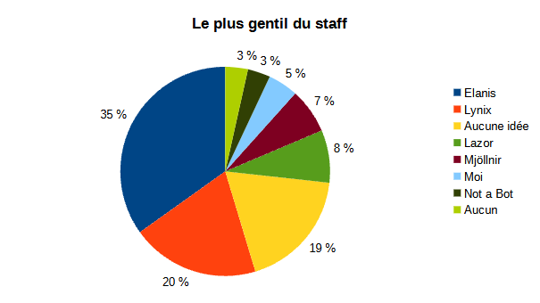

### Quel est le plus méchant des modos ?

?, ¯\_(ツ)_/¯, Lynix, Lazor, Remqb, Aussi lazor, Elanis, Lynix, Lynix, Lazor, .\*, Mjolnir, Je ne sais pas
Je connais aucun des modos, Lazor, qui pour que ce soit grammaticalement correct, Praetonus, tous cf question suivante :p, Lazor, Charles, Lynix, Lynix, Elanis, tous sauf lazor, Lynix, Mjoméchant è_é, Charles, Aucun, ils sentent tous la rose :), Tous, Lazor kappa, Je banni les méchants, Ils sont tous méchants., je ne sais pas, Not a Bot, Aucune idée, Lynix, Lynix, Lynix, Charles, Elanis, Lazor ? Lynix ?, Dr Lynix, Lazor le plus aigri (au sens littéral) mais aussi l'un des plus sages, moi, Lynix, c'est qui?, les autres, Lynix, en plus il speedrun une calvitie, Mjöllnir, Pas d’avis., Partéronuse, Mjo, Elanis aussi, bien évidemment, lazor Kappa, Lynix, Lynix, Lynix, Le 2e, Aucune idée, ceux qui ont pas de repo ou un dégeulasse, Lynix, toi, y'en a pas que des gens sympathiques (sauf lynix), Lynux, c'est secret aussi, Lazor, Lynix ;), Lynix ;), Jsp, Raz, Lynix, undefined, Elanis, Personne, Lynix, ton 2 éme arobase, idk, Lezenn, Lynix, Random, Lynix, Pas lui, je veux pas me faire ban du serveur, Mjo, Lynix, Lynxi, Aucun, Elanis, charles ( en vrai jamais eu l'occas d'avoir eu une conv avec lui), lynix (sincérement), Lynix, pas d’avis, pas d'avis, ne sais pas, Raz (second degré évidemment, ça fait un bail que je suis plus l'actu de qui est dans la modération d'ailleurs), aucun, NotABot, Lynix, ?, Compiler, Lynix

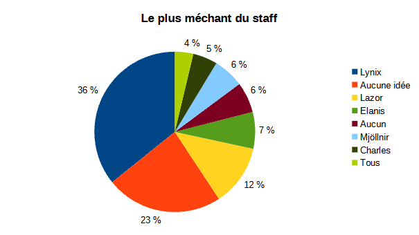

### Lynix est-il vieux ?

On observe que 83% des répondants pensent que Lynix est vieux (à raison).

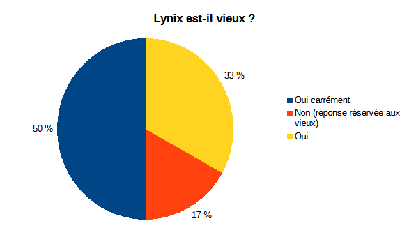

| Réponse                          | Quantité |
| -------------------------------- | -------: |
| Oui carrément                    | 71       |
| Non (réponse réservée aux vieux) | 24       |
| Oui                              | 47       |
| **Total**                        | 142      |

### Un libraire...

Voici les réponses données:

20€, 20, 42, 20€, 20€, Cela dépend de la couleur du zèbre jaune au coucher de soleil, mais on peu estimer sur une echelle de a à z en prenant un que la réponse est 20, 10, 20, 20, 20, Oui, 20€, 20 euros, Avec ou sans fraude à la TVA ?, 20€, -70+80=10 \[...] -90+100=10 \[...] 10+10=20 donc il a fait 20€ de bénéf. Après avec l'inflation ça vaut plus rien tout ça..., 10€ , 20€, 20€, 20€, 20, 20, (╯°□°）╯︵ ┻━┻ , 0, 20, 20€ brut, mais 16 si on retire la TVA, mais 12 si on retire l'IS, mais 6 si on retire les cotisations, 20€, 20€, 20€ + la revente de dolipranes , 20, 20, 20€, 20€, 2 transactions de +10 euros, 20€, 12, 20, 20, 10, Analysis  python Copy code # Calcul du bénéfice total du libraire # Première transaction: Achat à 70€, vente à 80€ profit_first_transaction = 80 - 70  # Deuxième transaction: Achat à 90€, vente à 100€ profit_second_transaction = 100 - 90  # Bénéfice total total_profit = profit_first_transaction + profit_second_transaction total_profit Result 20, 20, 20€, Ptin toujours cette connerie qui revient encore et toujours x), 20€, Bénéfice total = 20, sinon 10 parce qu'il a réinvestit, 20E, Qui achète un livre à 100 balles déjà ?, 42, 0€, 20, 20, 20, 20, 20, 20, -70+80-90+100=20€, 20€, 20, Lynix, 20, J'ACCUSE le libraire de détournement , 20, 20€, 10€, 10, 20, 10€, 20, 20 euro , 42, 20,05, 10, ca depend si la tva pour les occasions est la meme que pour le neuf, 20?, 10€, 0, Quel est le rapport avec le vin, 20, 20€, ça dépend du montant des impôts que le libraire a du payer sur le résultat net, et il faut aussi prendre en compte les charges salariale et de l'espace de vente, 10, 0, 20, 20€, 20 e ?, 20€ !, -15, 20€, 20€, Hello I like money, Prae arrête, ça suffit , 20, tg, 20, 20€, 10€, 20 ? ou 0, 0, 80 - 70 + 100 - 90  = 20 ez, trop de débat je préfère dire qu'il a gagné de l'argent. Non en vrai il a dépensé 70 + 90 => 160 et a gagné 80 + 100 => 180 donc par la magie des math il a fait un bénéfice de 180 - 160 => 20 euros ?, 20, 10, 20euros mais jsp pk , Flemme il est 24h44, 20, Aucun, c'est sensé être un captcha ? En IT on est flemmard xD, 20€, 20€, 20€, 20euro, 20, 20, 10, 20, 20€, 20, 20€(2\*10€)?, 20, 20€, 0, C'est un livre ou un nft de livre ?, 500 euros ?, 20, 20, 20 euros, sans compter l'optimisation fiscale, 20€, 20, 20€ et un mars, 20, 0, 20€, 708090100€ (inflation oblige), 10, Il faut changer de porte , 20, 10, 20, mais ça sent le poisson pourri cette histoire donc peut être 0, 20€, 20€, 20€ (Je tombe à -70, je rajoute 80 --> 10 / Je tombe à -80 suite au second achat et je gagne 20 grâce au 100) , 30€, 20€, 20, 10, 20, Réponse 42, 20€, 10€ lors de la 1ere vente et 10€ lors de la 2eme mais en faites comme il a payer 70€ la 1ere fois et 90€ la 2eme Mais comme il a payer 60€+80€ (soit 140€) en tout donc au final il a rien gagner au contraire.., 0, 20€, 20, Y a un piège à la con quelque part mais j'ai oublié du coup je réponds pas mais je répond quand même., 20, 2147483647 €, 10 balles, 20, 10 euros ?, 20

La bonne réponse était bien évidemment 42. (en vrai c'est 20€)